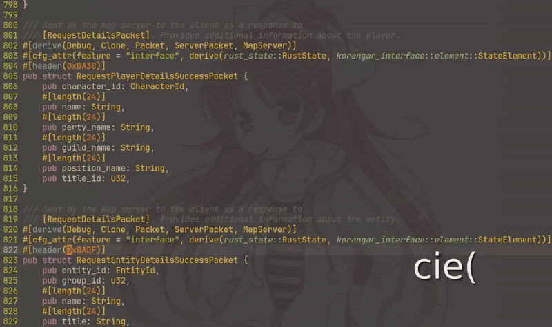
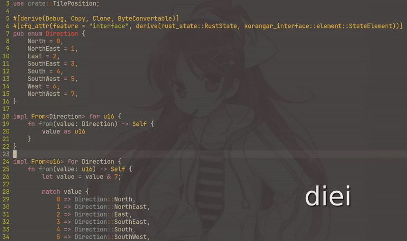

# delete-assassin.nvim

Like [YankAssassin](https://github.com/svban/YankAssassin.nvim) but for the delete and change operators.
This plugin makes your cursor stay put when using the `d` and `c` operators, very useful when working with text objects.
If you like text objects, check out [unified-text-objects.nvim](https://github.com/vE5li/unified-text-objects.nvim) used in the clips below.

### Changing text



### Deleting text



## Installation

### lazy.nvim

```lua
return {
    "vE5li/delete-assassin.nvim",
    config = true,
    ---@module "delete-assassin"
    ---@type delete-assassin.Options
    opts = {},
}
```

## Configuration

The full list of options and their default values:

```lua
opts = {
    -- Whether or not to restore the cursor position after deleting text (`d` operator)
    assassinate_delete = true,
    -- Whether or not to restore the cursor position after changing text (`c` operator)
    assassinate_change = true,
}
```
